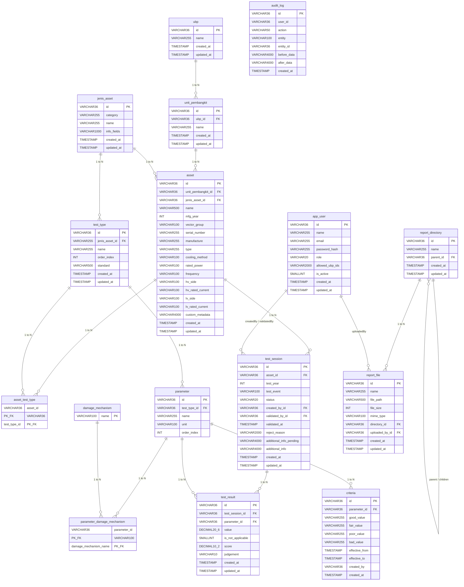
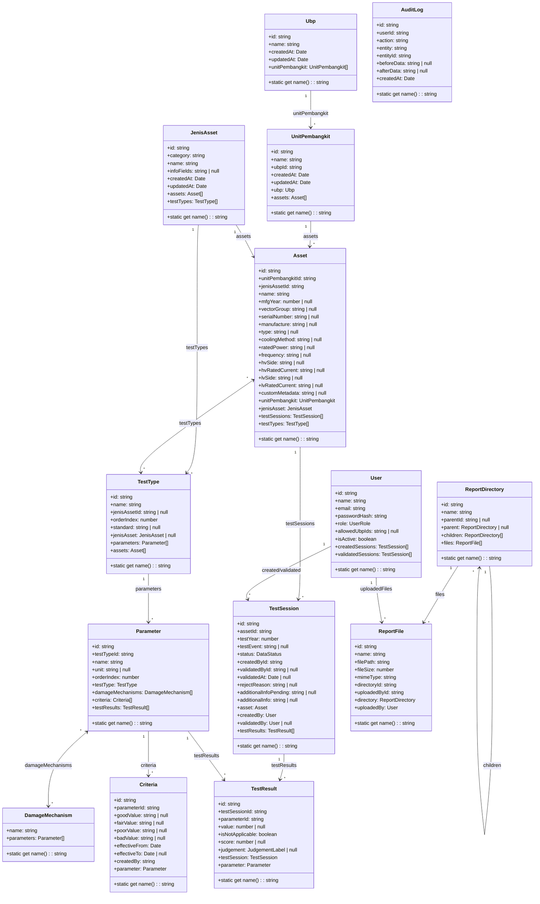

# System Assessment Trafo (SIAT) - Database & Entity Diagrams

Dokumen ini berisi **Entity Relationship Diagram (ERD)** dan **Class Diagram (TypeORM Entities)** terbaru yang merefleksikan skema database Oracle terbaru dari aplikasi SIAT.

> 🎨 **Diagram Draw.io (Editable)**:
> File diagram Draw.io multi-page lengkap dapat dibuka/diedit langsung melalui Draw.io di:
> [docs/diagram.drawio](file:///c:/Users/LENOVO/College/KP/trafo/siat/docs/diagram.drawio)

---

## 1. Entity Relationship Diagram (ERD)

---

## 2. TypeORM Entity Class Diagram

